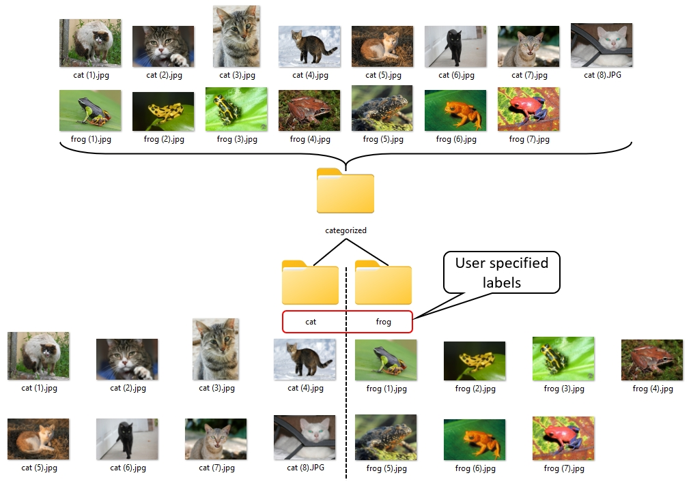

# CLIP Playground
A collection of useful scripts that show the potential of Open AI's powerful multimodal model CLIP

## CLIP-based image categorizer
Given a path to a folder containing unordered images, this small script allows you to categorize all the images according to the labels you specify. 

For example, imagine you have a folder with a bunch of photos of cats and frogs. You first specify the path to this folder, and then define the labels by which you want to categorize the photos (in this case labels = ["cats", "frogs"]. Depending on your hardware (gpu is recommended here) and the number of photos, the categorization process may take a while. The result looks similar to the following...

  

  
Happy categorizing!
